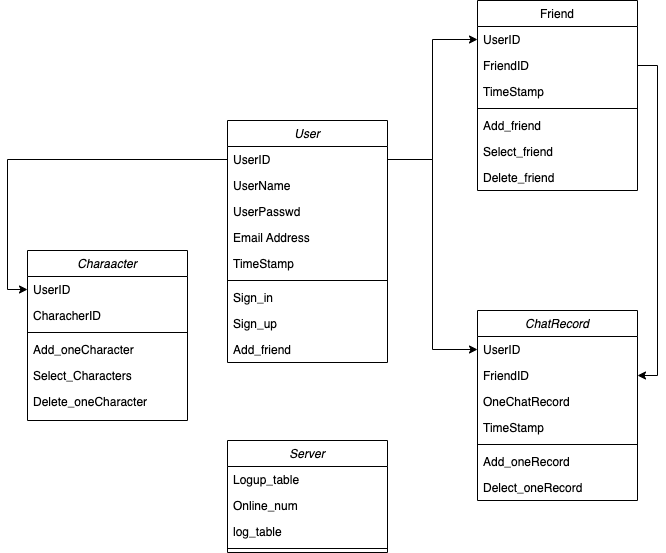

# server
Spring Boot Server For ZJUSE2023B3

## Todo List
### 抽象工作
- [ ] 基础架构搭建

### 具体工作目录
- [ ] 数据接口设计
  - [ ] 基础数据结构
  - [ ] 编码方式
  - [ ] ...
- [ ] 数据库设计
- 
- [ ] 登录等功能
  - [ ] 注册
  - [ ] 登录
- [ ] 用户系统
  - [ ] 修改用户名
  - [ ] 修改邮箱
  - [ ] 修改密码
- [ ] 好友系统
  - [ ] 添加好友
  - [ ] 删除好友
  - [ ] 查询好友
- [ ] 聊天系统
  - [ ] 查询所有聊天记录
  - [ ] 删除聊天记录
  - [ ] 添加一条记录
- [ ] 消息系统
  - [ ] 发送消息
- [ ] 服务器相关
  - [ ] 日志系统
  - [ ] 用户管理

